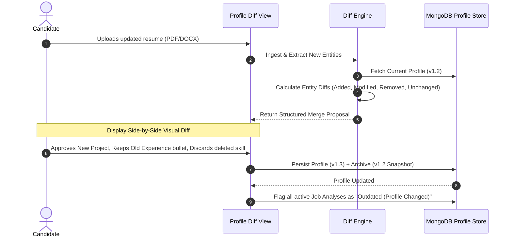

# CAREERX — Product Architecture, UX Specification & Living Profile Blueprint

> **Product Vision**: CAREERX is an Agentic AI Career Intelligence and Job Readiness Platform that shifts candidate evaluation from unverified claims to an auditable, continuously evolving career record grounded in contextual evidence.
>
> **Core Loop**:
> $$\text{CLAIM} \longrightarrow \text{EVIDENCE} \longrightarrow \text{JOB REQUIREMENT} \longrightarrow \text{MATCH} \longrightarrow \text{GAP} \longrightarrow \text{IMPROVEMENT} \longrightarrow \text{NEW EVIDENCE} \longrightarrow \text{REASSESSMENT}$$

---

## 1. The Core Conceptual Model: Profile vs. Jobs

```
                               ┌──────────────────────────────────────────────────────────┐
                               │                 LIVING CAREER PROFILE                    │
                               │  (Continuous, evolving career memory & evidence base)    │
                               │                                                          │
                               │  ├── Personal & Education (Transcripts, Degrees)         │
                               │  ├── Work Experience (Roles, Impacts, Artifacts)         │
                               │  ├── Projects (Code, Reports, Live Demos)                │
                               │  ├── Skills (Claims grounded in Project/Work context)     │
                               │  ├── Achievements & Certifications (Credentials, IDs)    │
                               │  ├── Evidence Vault (L1 Claim -> L2 Context -> L3 Art)  │
                               │  └── Connected Sources (GitHub Repositories, Metadata)   │
                               │  └── Version History (v1.0 -> v1.1 -> v1.2...)           │
                               └────────────────────────────┬─────────────────────────────┘
                                                            │
                                  Evaluated against         │ (One-to-Many Relationship)
                                                            │
                 ┌──────────────────────────────────────────┼──────────────────────────────────────────┐
                 ▼                                          ▼                                          ▼
   ┌───────────────────────────┐              ┌───────────────────────────┐              ┌───────────────────────────┐
   │       JOB ANALYSIS 1      │              │       JOB ANALYSIS 2      │              │       JOB ANALYSIS 3      │
   │  (Software Engineer - X)  │              │  (Backend Developer - Y)  │              │    (AI Engineer - Z)      │
   │                           │              │                           │              │                           │
   │ ├── Extracted JD Schema   │              │ ├── Extracted JD Schema   │              │ ├── Extracted JD Schema   │
   │ ├── Evidence Grounding    │              │ ├── Evidence Grounding    │              │ ├── Evidence Grounding    │
   │ ├── Deterministic JRS_v1  │              │ ├── Deterministic JRS_v1  │              │ ├── Deterministic JRS_v1  │
   │ ├── Tailored Resume Draft │              │ ├── Tailored Resume Draft │              │ ├── Tailored Resume Draft │
   │ ├── Skill Gaps & Roadmap  │              │ ├── Skill Gaps & Roadmap  │              │ ├── Skill Gaps & Roadmap  │
   │ └── [Status: UP-TO-DATE]  │              │ └── [Status: OUTDATED]    │              │ └── [Status: UP-TO-DATE]  │
   └───────────────────────────┘              └───────────────────────────┘              └───────────────────────────┘
                                                            ▲
                                                            │ [Profile Updated: New Project Added]
                                                            │ Flagged: "Profile changed — re-analyze?"
```

---

## 2. Website Sitemap & Information Architecture

```
CAREERX Navigation
├── 1. Dashboard (Central Hub)
│   ├── Quick Readiness Overview (Top Active Jobs & Average Readiness)
│   ├── Profile Health & Evidence Strength Summary
│   ├── High-Impact Skill Gaps (Cross-Job Priority Matrix)
│   ├── Recent Activity Feed & Re-Analysis Alerts
│   └── Quick Action: [+ Add New Job] / [+ Update Profile]
│
├── 2. Profile (Living Career Record)
│   ├── Profile Summary & Version History (v1.0, v1.1, Diff Inspector)
│   ├── Section Editors (Education, Experience, Projects, Skills, Certs, Achievements)
│   ├── Resume Ingestion & Intelligent Diff Resolver (Merge Conflict UI)
│   ├── Global Resume Diagnostic (ATS, Clarity, Claim Quality, Structure)
│   └── GitHub Connection & Discovered Repository Portfolio
│
├── 3. Evidence Vault (Candidate Evidence Store)
│   ├── Evidence Matrix by Category (Education, Experience, Projects, Skills, Certs)
│   ├── Evidence Level Breakdown (L1 Claim | L2 Contextual | L3 Artifact | L4 Demonstrated)
│   ├── Direct Artifact Upload (Reports, PDFs, Screenshots, Demo Links)
│   └── Verification State Viewer (Self-Declared | Heuristic Validated | Could Not Independently Verify)
│
├── 4. Jobs (Job-Specific Intelligence)
│   ├── Jobs Directory & Filterable Grid (Status, Readiness, Critical Gaps, Date)
│   ├── Add Job Flow (Multi-Format Ingestion -> Visible Progress Stepper -> Analysis)
│   └── Job Analysis Workspace (Tabs: Overview, Evidence, Resume, Gaps, Resources, Projects, Interview)
│
├── 5. Career Growth (Longitudinal Progress)
│   ├── Evidence Accumulation Timeline (Skill Evolution: Missing -> Learning -> Built -> Evidenced)
│   ├── Cross-Job Readiness Trajectory Charts
│   └── Resolved Skill Gap Milestones
│
└── 6. Settings
    ├── API Keys (LLM Providers: Gemini, OpenAI)
    ├── GitHub OAuth & Token Permissions
    ├── Export / Backup Career Memory (JSON/BSON export)
    └── Data Privacy & Local Storage Preferences
```

---

## 3. Profile Evolution & Intelligent Resume Diffing

When a user uploads a new resume or adds a project, CAREERX never blindly overwrites the existing profile. It executes a **3-Way Semantic Diff**:



---

## 4. Jobs Section & Detailed Workspace UX

### 4.1 Jobs Dashboard
* **Header**: Action button `[+ Add New Job]`, Search filter, Sort by (Readiness, Recent, Gap Count).
* **Job Cards**:
  * Title & Company (e.g., *Backend Developer — Acme Corp*)
  * Readiness Badge: `78% JRS` (with evidence confidence subtext)
  * ATS Compatibility: `84%`
  * Critical Gaps Pill: `1 Critical Gap (PostgreSQL)`
  * Profile Sync Status: `Synced with Profile v1.3` or `⚠️ Profile Updated (Re-analysis Available)`
  * Quick Actions: `[Open Analysis]`, `[Re-Run]`, `[Archive]`

### 4.2 Job Analysis Tabs Structure
1. **[Overview]**: Executive summary, Readiness Gauge ($JRS_{v1}$), Top 3 Strengths, Top 3 Critical Gaps, Contribution Breakdown.
2. **[Evidence Matrix]**: Requirement-by-Requirement table mapping JD items to exact Profile Evidence chunks, Evidence Level (L1–L4), Match Score, and Confidence.
3. **[Resume Intelligence]**: Job-specific ATS & Clarity diagnostic, bullet rewrite suggestions with `[Accept]`, `[Reject]`, `[Edit]`, and side-by-side draft comparison.
4. **[GitHub Opportunities]**: Discovered repositories in candidate's GitHub that match the JD but are missing from the resume, with `[Preview Resume Addition]` and `[Add to Resume]`.
5. **[Skill Gaps & Action Plan]**: Clear root-cause explanation for each gap and step-by-step remediation guide.
6. **[Learning Resources]**: Ranked educational paths (Official Docs, Courses, Tutorials) scored by relevance, quality, and estimated effort.
7. **[Mock Interview]** *(Phase 7)*: Adaptive multi-turn Q&A targeting unresolved gaps.

---

## 5. Architectural Pattern & Agent Boundaries

```
+---------------------------------------------------------------------------------------------------+
|                               ARCHITECTURAL BOUNDARY CLASSIFICATION                               |
+--------------------------+-----------------------+------------------------------------------------+
| Subsystem                | Architectural Pattern | Implementation Logic                           |
+--------------------------+-----------------------+------------------------------------------------+
| Document Ingestion       | Deterministic Service | pdfplumber, python-docx, regex normalizer      |
| Profile Diff Engine      | Deterministic + LLM   | Hash & entity matching + semantic change check |
| JD Requirement Extractor | LLM Structured Output | Pydantic Schema (`response_format`)            |
| Evidence Retrieval (RAG) | Deterministic RAG     | Sentence-Transformers + In-Memory Cosine Sim   |
| JRS Scoring Engine       | Deterministic Math    | Pure Python weighted aggregation formula       |
| Global Resume Diagnostic | Hybrid Rule + LLM     | Regex length/formatting rules + LLM clarity    |
| Bullet Refactoring       | Constrained LLM Call  | Few-shot prompt grounded in candidate evidence |
| Resource Ranker          | Deterministic Ranker  | Multi-factor scoring (Relevance x Source Score)|
| Adaptive Mock Interview  | LangGraph State Agent | Multi-turn StateGraph with cyclic memory       |
+--------------------------+-----------------------+------------------------------------------------+
```

---

## 6. Implementation Scope Allocation

* **[MVP] (Phases 1 to 6)**:
  * Full React + Vite + Tailwind frontend shell with Navigation (Dashboard, Profile, Evidence Vault, Jobs, Growth).
  * Living Profile document model in MongoDB with manual add/edit/delete across all sections.
  * PDF/DOCX Document parsing + Structured LLM entity extraction.
  * Evidence Vault with 4-tier model (L1–L4 classification).
  * Jobs management (Add Job, Persistent history, Job Analysis tabs: Overview, Evidence, Gaps, Resources).
  * Deterministic $JRS_{v1}$ calculation and explainability engine.
* **[PHASE 2 / POST-MVP] (Phases 7 & 8)**:
  * Profile Diff & Merge Engine on resume re-upload.
  * GitHub repository portfolio probe and job opportunity discovery.
  * Agentic resume bullet editing with interactive accept/reject and draft history.
  * LangGraph Adaptive Mock Interview state engine.
  * Dynamic Reassessment loop.
* **[RESEARCH / THESIS] (Phase 9)**:
  * 4-Way Retrieval Ablation Benchmark (Dense vs. BM25 vs. Hybrid RRF vs. Cross-Encoder).
  * Quantitative scoring validation & LaTeX thesis report.
* **[PRODUCTION LATER]**:
  * Cloud vector databases (Atlas Vector Search / Qdrant).
  * Async background worker queues (Celery / Redis).
  * Enterprise GitHub OAuth and OAuth2 user authentication.
